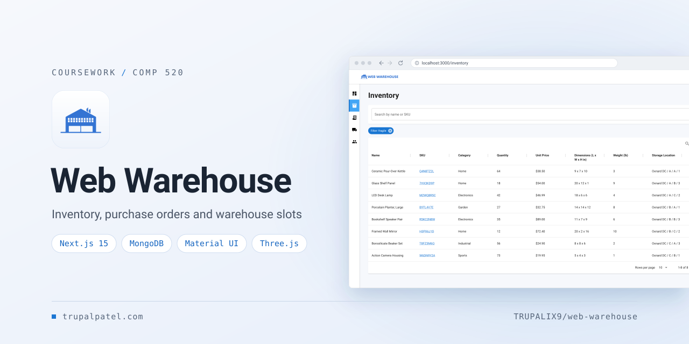
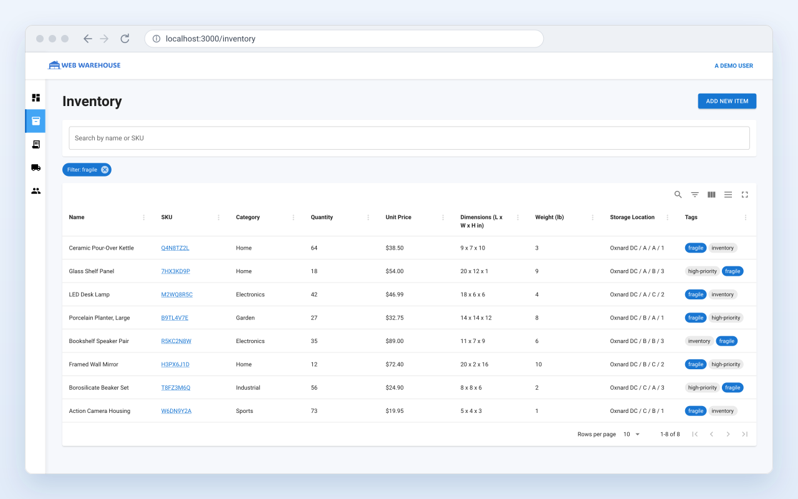
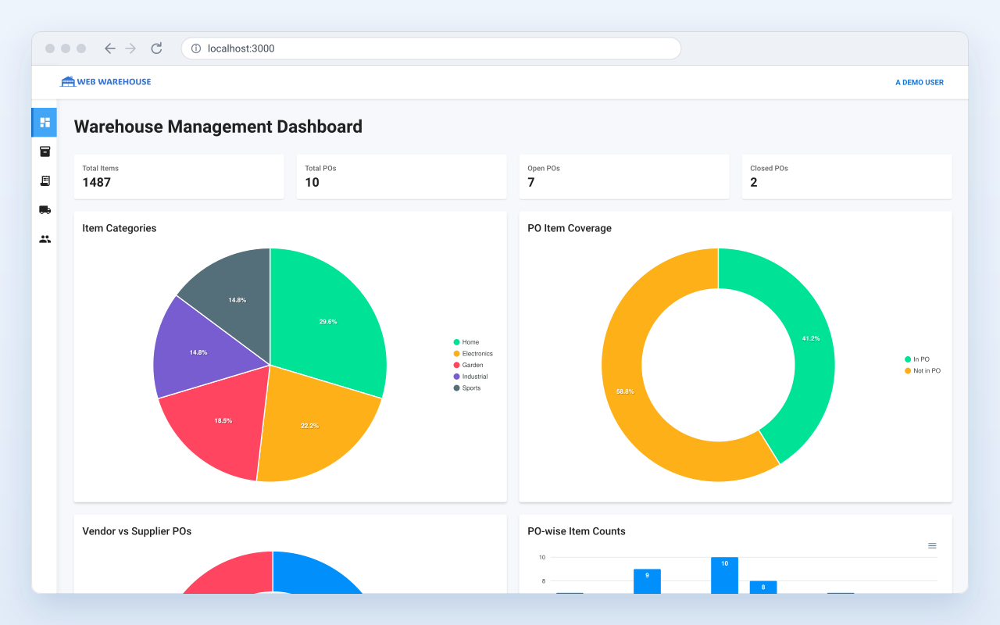
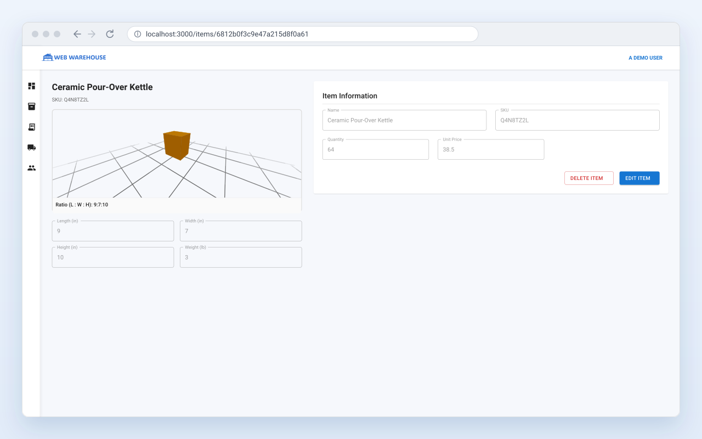
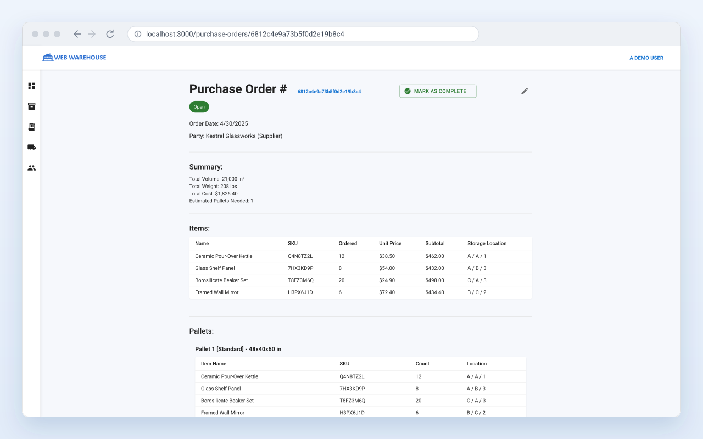
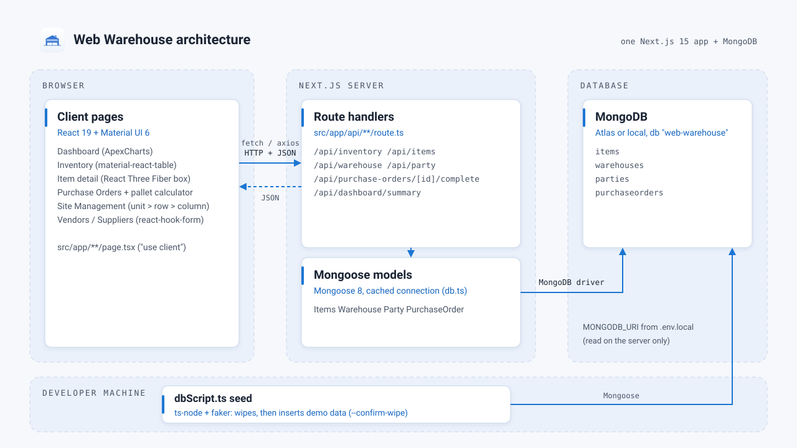

<p align="center">
  
</p>

<p align="center"><strong>A full-stack warehouse and inventory app: track stock, lay out warehouse slots, and run supplier and vendor purchase orders with pallet estimates.</strong></p>

<p align="center">
  <a href="https://trupalpatel.com/projects/web-warehouse"></a>
  
  
  
  
  
</p>

<p align="center">
  <a href="https://trupalpatel.com/projects/web-warehouse"><strong>Case study</strong></a> ·
  <a href="https://trupalpatel.com"><strong>Portfolio</strong></a>
</p>

---

## Overview

Web Warehouse is a warehouse and inventory management system built on the Next.js 15 App Router with MongoDB. It keeps an item catalog with dimensions, weight and stock levels. Items can be placed in a Unit > Row > Column warehouse layout. Purchase orders move stock in from suppliers and out to vendors, and the app estimates how many standard pallets each order needs.

It was built as a term project for COMP 520 at CSU Channel Islands. The project report (`Trupal Patel - COMP 520 Term Project.docx`) and slides (`Web Warehouse TRUPAL.pptx`) are in the repository root.

## Features

- **Dashboard**: stat cards for total stock quantity and total, open and closed purchase orders, plus ApexCharts for item categories, PO item coverage, vendor vs supplier POs, item counts per PO, and the 10 highest- and lowest-stocked items.
- **Inventory**: a material-react-table of every item (SKU, category, quantity, unit price, L x W x H, weight, storage location, tags). Search by name or SKU, or click a tag to filter by it.
- **Item detail with 3D preview**: React Three Fiber draws a box scaled to the item's length, width and height on a grid, with orbit controls and the simplified L : W : H ratio. Items can be created, edited and deleted.
- **Site Management**: build warehouses as units, rows and columns, then assign unassigned items to slots by hand (Assign toggle) or with **Smart Fill**, which fills the empty slots automatically.
- **Purchase orders**: supplier (incoming) and vendor (outgoing) orders, each with a total volume, weight and cost summary. **Calculate Pallets** packs the ordered items by volume onto 48 x 40 x 60 in standard pallets. **Mark as Complete** asks for confirmation, then adds stock for a supplier PO or deducts it for a vendor PO, once.
- **Vendors and suppliers**: add, edit and delete parties with a validated form (name, phone, email, address).
- **Demo data seed**: `dbScript.ts` fills an empty database with faker-generated parties, one warehouse layout, 27 items and 10 purchase orders.

## Screenshots

<table>
  <tr>
    <td align="center" width="50%">
      
      <br /><sub><b>Inventory</b>, filtered by a tag</sub>
    </td>
    <td align="center" width="50%">
      
      <br /><sub><b>Dashboard</b></sub>
    </td>
  </tr>
  <tr>
    <td align="center" width="50%">
      
      <br /><sub><b>Item detail</b> with the 3D box preview</sub>
    </td>
    <td align="center" width="50%">
      
      <br /><sub><b>Purchase order</b> with pallet breakdown</sub>
    </td>
  </tr>
</table>

<sub>Screens are recreated from the app's real UI in SVG, filled with fictional demo data.</sub>

## Architecture

<p align="center">
  
</p>

The client pages call the app's own route handlers under `src/app/api` with `fetch` and `axios`. The route handlers use Mongoose models (`Items`, `Warehouse`, `Party`, `PurchaseOrder`) to read and write the `web-warehouse` database, through one cached connection in `src/app/api/db.ts`. The seed script talks to the same database directly through Mongoose.

| Route | Methods | Purpose |
|---|---|---|
| `/api/inventory` | GET | Items joined with their warehouse name, for the inventory table |
| `/api/items`, `/api/items/[id]` | GET, POST, PUT, DELETE | Item CRUD |
| `/api/items/assign`, `/unassign`, `/unassignedItems`, `/remove-assignments` | PUT, GET | Slot assignment for Site Management |
| `/api/warehouse`, `/api/warehouse/[id]` | GET, POST, PUT, DELETE | Warehouse layouts |
| `/api/party`, `/api/party/[id]` | GET, POST, PUT, DELETE | Vendors and suppliers |
| `/api/purchase-orders`, `/api/purchase-orders/[id]` | GET, POST, PUT, DELETE | Purchase orders and their pallets |
| `/api/purchase-orders/[id]/complete` | PUT | Complete a PO and apply its stock change |
| `/api/dashboard/summary` | GET | Dashboard numbers and chart series |

## Tech stack

| Layer | Technology |
|---|---|
| App | Next.js 15 (App Router, route handlers), React 19, TypeScript |
| UI | Material UI 6 (Emotion), material-react-table 3, ApexCharts (react-apexcharts), react-hook-form |
| 3D | Three.js, React Three Fiber, drei |
| Data | MongoDB (Atlas or local), Mongoose 8 |
| Styling | MUI `sx` styles; Tailwind CSS 4 via `globals.css` for the page shell |
| Tooling | npm, ESLint (next/core-web-vitals), ts-node and @faker-js/faker for the seed script |

## Getting started

### Prerequisites

- Node.js 18.18 or newer (the Next.js 15 requirement)
- npm (the repository ships a `package-lock.json`)
- A MongoDB database: a MongoDB Atlas cluster or a local `mongod`

### Install

```bash
git clone https://github.com/TRUPALIX9/web-warehouse.git
cd web-warehouse
npm ci
```

### Environment variables

Copy `.env.example` to `.env.local` and fill it in:

| Variable | Required | Description |
|---|---|---|
| `MONGODB_URI` | Yes | MongoDB connection string. The app and the seed script use the `web-warehouse` database on that server. |

### Seed demo data (optional, destructive)

> [!WARNING]
> The seed script **deletes every warehouse, item, party and purchase order** in the `web-warehouse` database before inserting demo data. It refuses to run without `--confirm-wipe`.

```bash
npx ts-node --compiler-options '{"module":"commonjs","moduleResolution":"node"}' dbScript.ts --confirm-wipe
```

It reads `MONGODB_URI` from the environment, `.env.local` or `.env`. It inserts 6 parties (3 vendors, 3 suppliers), one warehouse named `DEMO` with 3 units x 3 rows x 3 columns, 27 items (one per slot) and 10 open purchase orders.

### Run

```bash
npm run dev
```

Open [http://localhost:3000](http://localhost:3000). Other scripts: `npm run build`, `npm start` and `npm run lint`.

Good to know:

- `npm run dev` sets `NODE_OPTIONS` inline, which only works in POSIX shells. On Windows, run `npx next dev` instead.
- `next.config.ts` sets `typescript.ignoreBuildErrors` and `eslint.ignoreDuringBuilds`, so `next build` does not fail on type or lint errors. Run `npx tsc --noEmit` and `npm run lint` to see them.
- There is no authentication; the header shows a fixed "A DEMO USER".

## Project structure

```text
web-warehouse/
├── src/
│   ├── app/
│   │   ├── api/               # Route handlers (items, inventory, warehouse, party, purchase-orders, dashboard) + db.ts
│   │   ├── components/        # Header, Sidebar, 3D box view, warehouse / party / PO dialogs
│   │   ├── models/            # Mongoose schemas: Items, Warehouse, Party, PurchaseOrder, Pallet
│   │   ├── inventory/         # /inventory
│   │   ├── items/             # /items/[id] and /items/new
│   │   ├── purchase-orders/   # /purchase-orders and /purchase-orders/[id]
│   │   ├── site-managment/    # /site-managment (warehouse layouts)
│   │   ├── party/             # /party (vendors and suppliers)
│   │   ├── page.tsx           # Dashboard (/)
│   │   └── layout.tsx         # App shell: header, sidebar, loader
│   └── types/                 # Shared TypeScript types
├── public/                    # Wordmark (home.png), logo and favicons
├── docs/assets/               # README banner, icon, screenshots, architecture
├── dbScript.ts                # Demo data seed (destructive, needs --confirm-wipe)
└── .env.example               # Environment variable names
```

## Author

**Trupal Patel**

<p>
  <a href="https://trupalpatel.com">Portfolio</a> ·
  <a href="mailto:trupal.work@gmail.com">trupal.work@gmail.com</a> ·
  <a href="https://www.linkedin.com/in/trupalix">LinkedIn</a> ·
  <a href="https://github.com/TRUPALIX9">GitHub</a>
</p>

Thanks to Piyu for an early setup commit that added the first API route handlers, the Mongoose models and the demo seed script.

This project is for educational and demonstration use. Contact the author for commercial licensing.
